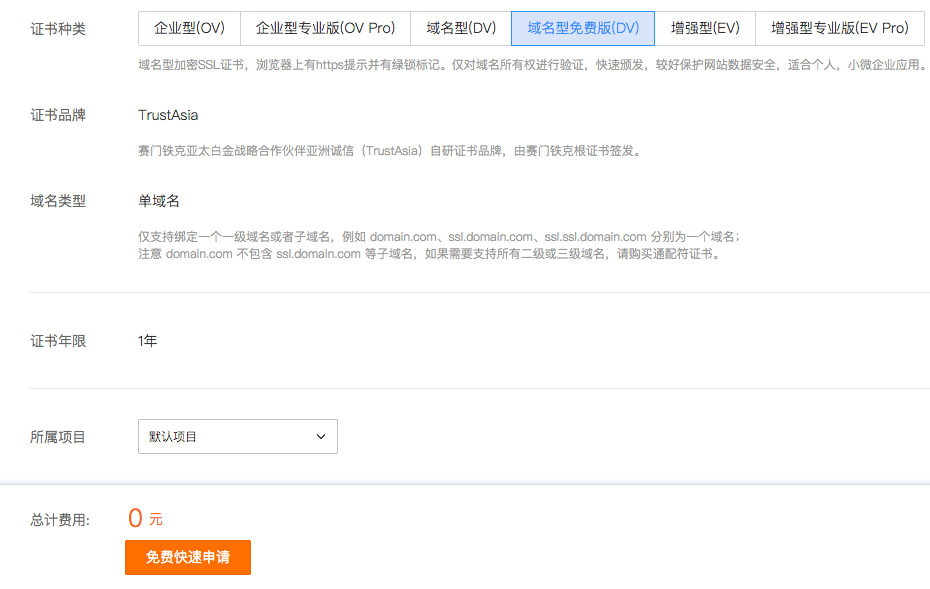

#### 什么是[http](https://baike.baidu.com/item/http/243074?fr=aladdin)
    HTTP（HyperText Transport Protocol）是超文本传输协议的缩写，它用于传送WWW方式的数据，关于HTTP协议的详细内容请参考RFC2616。HTTP协议采用了请求/响应模型。客户端向服务器发送一个请求，请求头包含请求的方法、URL、协议版本、以及包含请求修饰符、客户信息和内容的类似于MIME的消息结构。服务器以一个状态行作为响应，响应的内容包括消息协议的版本，成功或者错误编码加上包含服务器信息、实体元信息以及可能的实体内容。
    具体可看 [图解http](https://ttop5.gitbooks.io/illustration-http/content/index.html)

#### 什么是[https](https://zh.wikipedia.org/wiki/%E8%B6%85%E6%96%87%E6%9C%AC%E4%BC%A0%E8%BE%93%E5%AE%89%E5%85%A8%E5%8D%8F%E8%AE%AE)
    超文本传输安全协议（英语：Hypertext Transfer Protocol Secure，缩写：HTTPS，常称为HTTP over TLS，HTTP over SSL或HTTP Secure）是一种通过计算机网络进行安全通信的传输协议。HTTPS经由HTTP进行通信，但利用SSL/TLS来加密数据包。HTTPS开发的主要目的，是提供对网站服务器的身份认证，保护交换数据的隐私与完整性。这个协议由网景公司（Netscape）在1994年首次提出，随后扩展到互联网上。

#### http与https的区别
　　1、https协议需要到ca申请证书，一般免费证书较少，因而需要一定费用。

　　2、http是超文本传输协议，信息是明文传输，https则是具有安全性的ssl加密传输协议。

　　3、http和https使用的是完全不同的连接方式，用的端口也不一样，前者是80，后者是443。

　　4、http的连接很简单，是无状态的；HTTPS协议是由SSL+HTTP协议构建的可进行加密传输、身份认证的网络协议，比http协议安全。

<!--more-->

#### 申请SSL证书
    此处我所知道的两个免费申请SSL证书的方法
    [阿里云盾](https://common-buy.aliyun.com/?spm=5176.7968328.911106.btn1.7a834ebfb9gLqY&commodityCode=cas#/buy)点击打开
    [腾讯云](https://buy.cloud.tencent.com/ssl?fromSource=ssl&from=qcloudHpHeaderSsl)点击打开
    单域名免费版 --- 如 `likecc.top` `blog.likecc.top` 为两个域名 同一主域最多只能申请20张亚洲诚信品牌免费型DV版SSL证书

    腾讯云申请步骤
    

